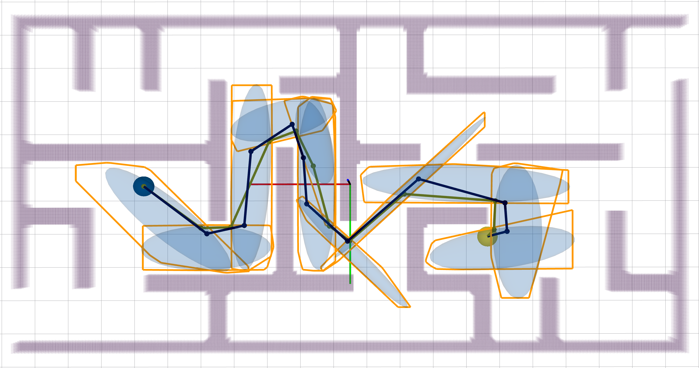

# Convex Cover of Collision-free Space for Trajectory Generation

## About

Code implementation for collision-free space approximation as polytopes to cover the same homotopic path or trajectory.

__Authors__: [Yuwei Wu](https://github.com/yuwei-wu), Igor Spasojevic,  Pratik Chaudhari, and Vijay Kumar from the [Kumar Lab](https://www.kumarrobotics.org/).

__Video Links__: [Youtube](https://youtu.be/k7CI7-fgSXE)


__Related Paper__: Y. Wu, I. Spasojevic, P. Chaudhari and V. Kumar, "Towards Optimizing a Convex Cover of Collision-Free Space for Trajectory Generation," in IEEE Robotics and Automation Letters, vol. 10, no. 5, pp. 4762-4769, May 2025


If this repo helps your research, please cite our paper at:

```
@ARTICLE{10935632,
  author={Wu, Yuwei and Spasojevic, Igor and Chaudhari, Pratik and Kumar, Vijay},
  journal={IEEE Robotics and Automation Letters}, 
  title={Towards Optimizing a Convex Cover of Collision-Free Space for Trajectory Generation}, 
  year={2025},
  volume={10},
  number={5},
  pages={4762-4769}}
```

## Acknowledgements


- Evaluation environments: [kr_param_map](https://github.com/KumarRobotics/kr_param_map)
- Front-end Path Planning: We use [OMPL](https://ompl.kavrakilab.org/) planning library
- Planning Modules and Visualization: We use the module in [GCOPTER](https://github.com/ZJU-FAST-Lab/GCOPTER)


## Run in Docker

### 1. Clone the repository

```bash
git clone https://github.com/KumarRobotics/kr_opt_sfc.git
```

### 2. Build the Docker image

Replace `$(whoami)` with your local username if needed.

```bash
docker build --build-arg user_name=$(whoami) -t opt_sfc .
```

### 3. Run the Docker container

Mount your local repo inside the container to `/home/<username>/opt_sfc_ws/src/kr_opt_sfc` for development.

```bash
docker run -it \
    -v $(pwd)/kr_opt_sfc:/home/$(whoami)/opt_sfc_ws/src/kr_opt_sfc \
    --env="DISPLAY" \
    --env="QT_X11_NO_MITSHM=1" \
    --volume="/tmp/.X11-unix:/tmp/.X11-unix:rw" \
    opt_sfc
```

### 4. Inside the container

Build and launch your ROS workspace:

```bash
catkin build
source devel/setup.bash
roslaunch opt_sfc sfc.launch
```aunch opt_sfc sfc.launch
```

## Run from Source

The repo has been tested on 20.04 with ros-desktop-full installation.


### 1. Prerequisites

#### 1.1 ROS and OMPL

Follow the guidance to install [ROS](https://wiki.ros.org/ROS/Installation) and install OMPL:
```
sudo apt install libompl-dev
```

### 2. Build on ROS 

```
mkdir -p opt_ws/src
cd opt_ws/src
git clone git@github.com:KumarRobotics/kr_opt_sfc.git
wstool init && wstool merge kr_opt_sfc/utils.rosinstall && wstool update
cd ..
catkin build
```

### 3. Run

```
source devel/setup.bash
roslaunch opt_sfc sfc.launch
```

In "kr_opt_sfc/src/opt_sfc/config/sfc.yaml", change paramters to test different performance. The default is debug mode to show each iteration.


### 4. Run in 2D Image Map 


To generate a 2D corridor, you can launch the 2D projection with


```
source devel/setup.bash
roslaunch opt_sfc sfc2d.launch
```

You can use the format specified in the kr_param_map to create the map from image inputs.

<p align="center">
  
  
</p>


## Maintaince

For any technical issues, please contact Yuwei Wu (yuweiwu@seas.upenn.edu, yuweiwu20001@outlook.com).
